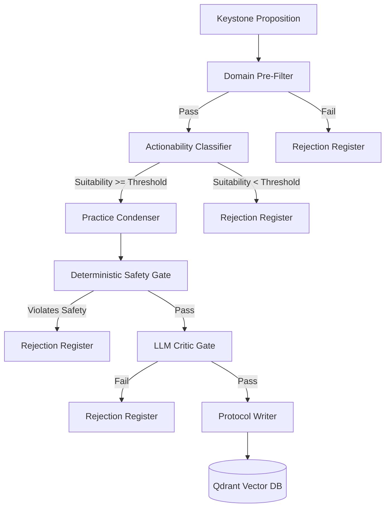

# Praxis


Praxis is the embodied experiment layer of the Meta-Bridge pipeline. It translates selected, provenance-backed Keystone propositions into minimal, reversible, low-risk practices and records what happens when those propositions encounter lived experience.

> [!IMPORTANT]
> Praxis is deliberately calibrated for a low yield: **5–15% approval is healthy**. Safety rejections are a feature, not a bug. Do not lower `MIN_PRAXIS_SUITABILITY`, raise `MAX_ALLOWED_RISK_TIER`, disable `ENFORCE_DOMAIN_PREFILTER`, or soften deterministic safety checks to increase volume.

---

## What Praxis Does

Praxis bridges theoretical insights and lived observation. It behaves like a careful compiler: read a Keystone proposition, reject anything unsafe or non-actionable, and emit only small, observable, reversible practices.

| Stage | Responsibility |
| --- | --- |
| Filter | Apply domain and risk boundaries before any generative step. |
| Classify | Score actionability, burden, observability, reversibility, and suitability. |
| Draft | Condense eligible propositions into low-risk practice candidates. |
| Review | Run deterministic safety checks and an LLM critic gate. |
| Track | Log participant observations without mutating canonical Keystone records. |
| Report | Build Markdown, HTML, and PDF programme reports. |

## Safety Boundary

Praxis **does not** generate medical, therapeutic, diagnostic, psychiatric, metaphysical-proof, remote-influence, or irreversible protocols. All approved practices must be limited in scope, observable, reversible, and low risk. Keystone records are canonical inputs and must remain read-only.

---

## Pipeline Architecture



---

## Quick Start

### 1. Create the local environment

```bash
chmod +x setup.sh
./setup.sh
```

The bootstrapper creates a virtual environment, installs dependencies, and creates `.env` from `.env.example` when present (otherwise it creates a blank local `.env`).

### 2. Configure environment variables

Create or update `.env` in the repository root:

```ini
ACTIONABILITY_MODEL=deepseek/deepseek-r1
CONDENSER_MODEL=deepseek/deepseek-r1
CRITIC_MODEL=google/gemma-3-27b-it
REFLECTION_MODEL=deepseek/deepseek-r1

OPENROUTER_API_KEY=your_key_here
EMBED_API_KEY=your_key_here

QDRANT_URL=http://localhost:6333
QDRANT_API_KEY=

# Optional direct DeepSeek routing.
DEEPSEEK_API_KEY=your_key_here
DEEPSEEK_BASE_URL=https://api.deepseek.com
DEEPSEEK_REASONER_MODEL=deepseek-reasoner
```

Never commit real API keys or service credentials. Configuration is loaded through `config.py`, which redacts sensitive fields in text logs.

### 3. Verify the project

```bash
.venv/bin/ruff check .
.venv/bin/python -m pytest
```

---

## Command Line Usage

The top-level execution point is `run.py`.

### Probe Qdrant

```bash
python run.py probe
```

### Generate protocols

```bash
python run.py generate
python run.py generate --limit 10
python run.py generate --limit 10 --dry-run
python run.py generate --keystone-id <id>
python run.py generate --min-convergence 0.80
```

### Classify candidates without writing protocols

```bash
python run.py classify --limit 10 --dry-run
```

### Log and reflect on observations

```bash
python run.py log-observation --file path/to/observation.json
python run.py log-observation --protocol-id <id> --file path/to/observation.json
python run.py reflect
python run.py reflect --observation-id <id>
```

### List and inspect stored items

```bash
python run.py list protocols
python run.py list protocols --status approved
python run.py list register
python run.py list feedback
python run.py show protocol <protocol_id>
python run.py show reflection <reflection_id>
```

### Validate payloads

```bash
python run.py validate protocol examples/protocol_example.json
```

### Export collections

```bash
python run.py export protocols --out data/protocols.json
python run.py export observations --out data/observations.json
python run.py export reflections --out data/reflections.json
```

### Build the report book

```bash
python run.py report --out data/praxis_book.md --pdf --html
```

---

## Data Collections

Praxis stores and reads several logical Qdrant collections:

| Collection | Purpose |
| --- | --- |
| `keystones` | Input candidate propositions from the Meta-Bridge pipeline. |
| `praxis_protocols` | Approved and active experimental practices. |
| `praxis_observations` | Participant logs containing outcomes, durations, and adverse effects. |
| `praxis_reflections` | Synthesised evaluations recommending repeats, adaptations, or halts. |
| `praxis_failures` | Rejection register describing which candidates failed and why. |

---

## Direct DeepSeek Routing

When `DEEPSEEK_API_KEY` is present, Praxis routes DeepSeek models directly to the native DeepSeek API endpoint instead of OpenRouter. The client translates OpenRouter-style model IDs such as `deepseek/deepseek-r1` to native identifiers such as `deepseek-reasoner` and omits incompatible request parameters for the reasoner model.

---

## Development Workflow

Use the same checks locally that run in GitHub Actions:

```bash
.venv/bin/ruff check .
.venv/bin/python -m pytest
```

Continuous integration is defined in `.github/workflows/ci.yml` and runs Ruff plus the full pytest suite on Python 3.11 and 3.12 for pushes, pull requests, and manual dispatches.

When changing interfaces, command-line flags, environment variables, report formats, or safety behaviour, update this README and the relevant files in `docs/` in the same change. If a test fails because a candidate is unsafe, fix the mock candidate rather than loosening the safety gate. A low-yield run is exactly the chap we invited to tea.
