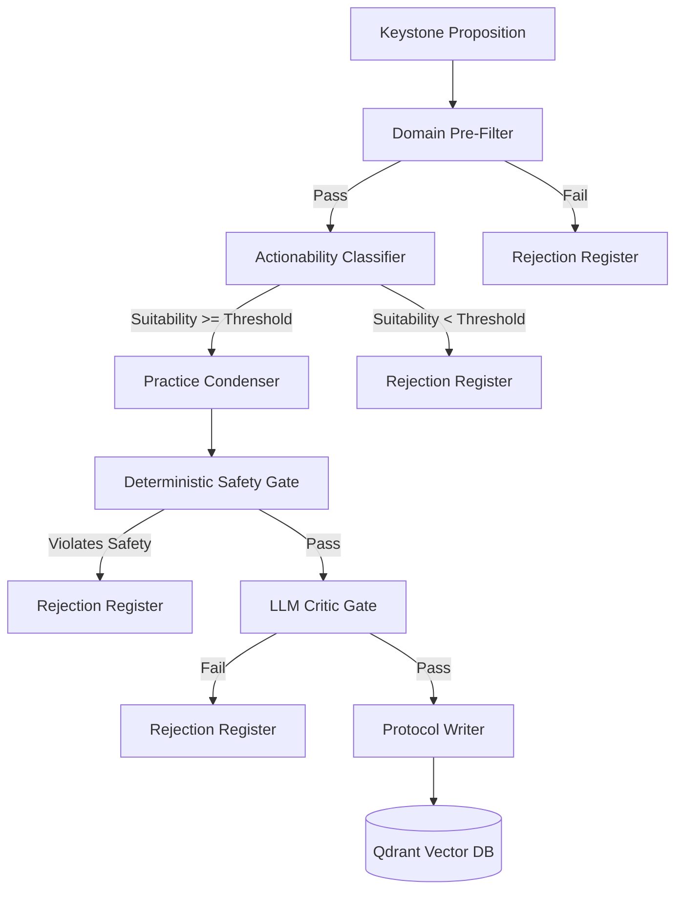

# Praxis

Praxis is the embodied experiment layer of the Meta-Bridge pipeline. It translates selected, provenance-backed Keystone propositions into minimal, reversible, low-risk practices and records what happens when those propositions encounter lived experience.

---

## 1. Project Purpose & Boundary

Praxis bridges theoretical insights and lived observation. Instead of accepting abstract conceptual models at face value, Praxis acts as a compiler that reads Keystone propositions and spits out safe, actionable behavioral protocols.

### What Praxis Does
* **Filters:** Evaluates incoming propositions against strict domain and risk boundaries.
* **Classifies:** Scores candidate propositions on actionability, burden, observability, and reversibility.
* **Drafts:** Translates eligible concepts into step-by-step practical guides.
* **Reviews:** Validates drafts using a multi-phase safety pipeline (Deterministic Safety + LLM Critic).
* **Tracks:** Logs participant observations and aggregates feedback.
* **Reports:** Compiles comprehensive experimental program report books (HTML/PDF/Markdown).

### What Praxis Does NOT Do (Safety Boundary)
* **No Medical Treatment:** Praxis explicitly excludes medical, therapeutic, diagnostic, or psychiatric interventions.
* **No Metaphysical Testing:** Praxis will not generate protocols attempting to verify survival of bodily death, remote influence, or non-empirical causal claims.
* **No Irreversible Actions:** All practices must be fully reversible, low-risk, and limited in scope.
* **No Canon Mutation:** Praxis records observational data and proposes modifications, but never directly alters or overwrites the foundational canonical models.

---

## 2. Pipeline Architecture

Below is the conceptual architecture showing how a candidate proposition flows through the Praxis funnel to become an active protocol:



---

## 3. Expected Yield and Calibration

The Keystone collection consists overwhelmingly of metaphysical propositions about the nature of reality, consciousness, death, and cosmic order. Most of them cannot responsibly become experiments.

> [!IMPORTANT]
> **Expect an approval rate in the range of 5–15% of eligible Keystones.** A run over several hundred Keystones producing twenty to forty approved protocols is the system working correctly, not failing.
>
> A low approval count is never grounds to lower `MIN_PRAXIS_SUITABILITY`, raise `MAX_ALLOWED_RISK_TIER`, disable `ENFORCE_DOMAIN_PREFILTER`, or soften any safety/critic rule.

---

## 4. Setup and Installation

### Dependencies
This project uses a split dependency model to isolate formatting and report generation libraries (like ReportLab):
* **Core dependencies:** Listed in `requirements.txt`.
* **Development/Linting dependencies:** Listed in `requirements-dev.txt`.
* **Report generation dependencies:** Listed in `requirements-report.txt`.

### Installation
Run the bootstrapper script to configure your environment:
```bash
chmod +x setup.sh
./setup.sh
```

### Environment Settings (`.env`)
Create a `.env` file in the root directory (automatically copied from `.env.example` by `setup.sh`):
```ini
ACTIONABILITY_MODEL=openrouter/google/gemini-2.5-pro
CONDENSER_MODEL=openrouter/google/gemini-2.5-flash
CRITIC_MODEL=openrouter/google/gemini-2.5-pro
REFLECTOR_MODEL=openrouter/google/gemini-2.5-flash

OPENROUTER_API_KEY=your_key_here
EMBED_API_KEY=your_key_here

QDRANT_URL=:memory:
QDRANT_API_KEY=test_key
```

---

## 5. Command Line Interface (CLI)

The top-level execution point is `run.py`.

### Generate Protocols
Assess and generate protocols from seeded Keystones:
```bash
python run.py generate --limit 10
```

### Classify Only
Analyze Keystones for actionability suitability without generating drafts:
```bash
python run.py classify
```

### Log Observations
Log an outcome observation against a protocol:
```bash
python run.py log-observation --protocol-id <id> --file path/to/observation.json
```

### Reflect on Observations
Trigger LLM reflection on logged observations:
```bash
python run.py reflect --observation-id <id>
```

### Export Results
Export data to static JSON files:
```bash
python run.py export --output-dir ./exports
```

### Generate Report Book
Compile HTML and PDF books summarizing the experimental program:
```bash
python run.py report --output-dir ./reports --pdf
```

---

## 6. Data Collection Descriptions

Praxis manages data across several logical Qdrant collections:
* **`keystones`**: The input candidate propositions from the Meta-Bridge pipeline.
* **`praxis_protocols`**: Approved and active experimental practices.
* **`praxis_observations`**: Participant logs containing execution outcomes, durations, and adverse effects.
* **`praxis_reflections`**: Synthesized evaluations of observations, recommending repeats, adaptations, or halts.
* **`praxis_failures`**: The rejection register detailing exactly which candidates failed at which stage.
