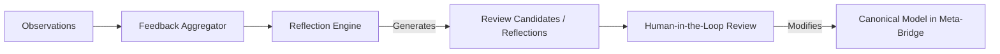

# Feedback Dynamics and Canonical Integrity

Praxis operates in a pipeline that separates **empirical observation** from **canonical declaration**. This separation is critical to preserving the reliability of the system.

---

## 1. The Principle of Canonical Integrity

In the Meta-Bridge pipeline, the canonical Keystone database represents verified, convergence-backed knowledge. Personal practices and self-reported experiments, while highly valuable, are subject to:
* Participant self-report bias.
* Placebo effects and cognitive framing.
* Small sample sizes and lack of experimental control.

Because empirical observations carry noise, they must never directly mutate or overwrite canonical Keystone definitions.

---

## 2. Review Candidates and Aggregations

Instead of modifying canon directly, Praxis collects logged observations and runs them through a feedback aggregator.

### The Feedback Engine Flow

1. **Aggregation:** The system aggregates observations, computing:
   * Verification Rate (proportion of `supported` outcomes).
   * Adverse Outcome Rate (proportion of negative reports).
   * Noise Confound (variance in self-reported outcomes).
2. **Reflection:** An LLM reviews the statistics, recommending:
   * `repeated_practical_support`: The practice works consistently. Keep doing it.
   * `adapt_protocol`: The practice works, but minor parameters (like duration) should be changed.
   * `halt_practice`: Too many adverse effects or low support. The practice is suspended.
3. **The Human-in-the-Loop (HITL) Gate:** All reflections suggesting changes are exported as candidates for review by human experts. Only after human validation may modifications flow back to the canonical database.
