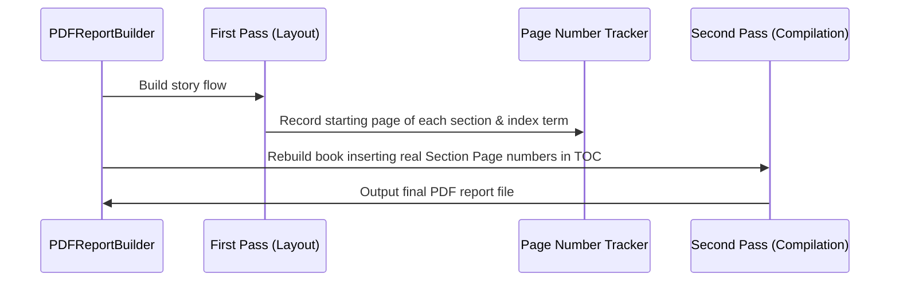

# Report Book Compilation

The Report Book represents a complete, self-contained summary of a Praxis experimental program.

---

## 1. Book Structure

The report book is compiled with a formal, structured layout:
1. **Title Page:** Project and compilation details.
2. **Epistemic Notice:** An explicit reminder explaining what self-reports can and cannot establish.
3. **How to Read This Book:** Introduction to risk tiers, outcomes, and protocol schemas.
4. **Active Protocols:** Approved and active experimental practices.
5. **Rejections Register (Appendix A):** Every candidate that failed at the pre-filter, actionability, or critic stage, along with details of why it failed.
6. **Program Index:** Key-value reference index mapping concepts to pages.

---

## 2. Epistemic Safeguards

Because Praxis runs personal behavioral practices, it is essential that readers do not misinterpret results as medical proof.
* **Header/Footer Warnings:** The PDF builder prints a footer reminder on every page:
  > *Epistemic Reminder: Individual self-reports are subject to placebo and framing effects, and do not constitute clinical trials or medical evidence.*
* **Interpretation Limits:** Every drafted protocol carries explicit limits stating the boundaries of what observing the practice can show.

---

## 3. Two-Pass PDF Build

To generate accurate Page Numbers for the Table of Contents (TOC) and the Program Index, the PDF report builder uses a two-pass layout engine powered by ReportLab.

1. **Pass 1 (Layout):** The document is rendered in memory. As flowables are drawn, a custom Canvas listener records the page numbers where section headings and index terms are placed.
2. **Pass 2 (Compilation):** The Table of Contents and the Index are updated with the exact, resolved page numbers. The final PDF is then written to disk.
